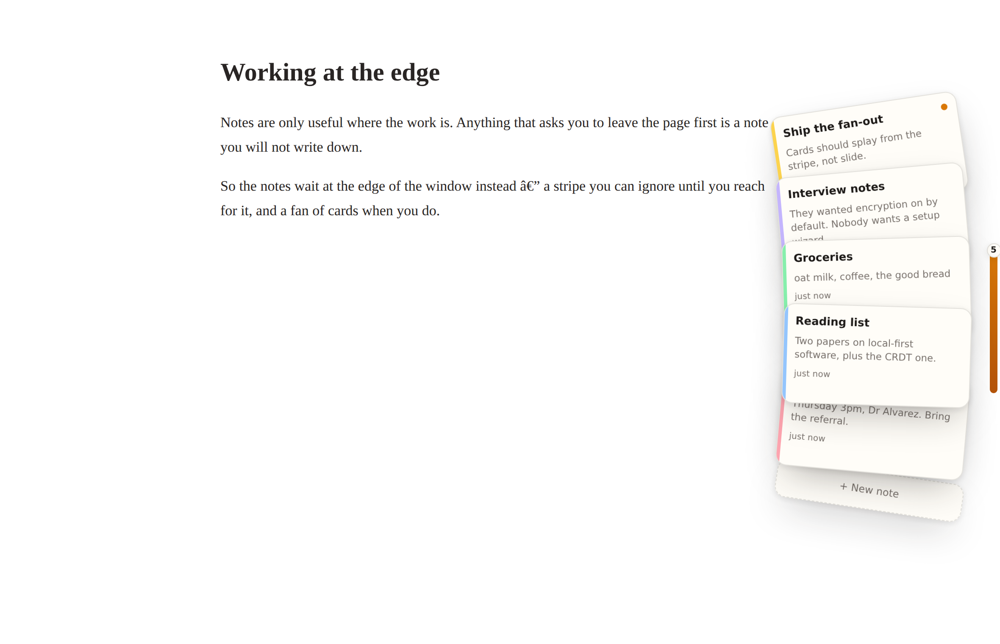

# sample

## Tucky — a Chrome extension

[`extension/`](extension/) is a recreation of [Tucky](https://tucky.io) — *notes at the edge,
an agent inside* — as an unpacked Chrome extension. Your notes sleep as a thin stripe on the
edge of every tab; reach over and they fan out; pick one and it opens. Ask the agent from any
page, and everything stays encrypted on your machine.



**Install:** `chrome://extensions` → Developer mode → **Load unpacked** → pick `extension/`.
There is no build step. Notes work straight away; paste an Anthropic API key in settings to
wake the agent.

See [`extension/README.md`](extension/README.md) for the feature list, the encryption model,
the architecture and how it differs from the macOS original. Run the tests — vault, agent loop
and a real Chromium load of the unpacked extension — with `npm test`.

## Claude Code plugins

This repo also enables two Claude Code plugins via project-level configuration in
[`.claude/settings.json`](.claude/settings.json). When you open the repo in a
Claude Code session that supports plugins, Claude Code reads these settings,
fetches each marketplace from GitHub, and installs/enables the plugins
automatically (you'll be prompted to trust the project settings the first time).

## Superpowers plugin

This repo enables the [Superpowers](https://github.com/obra/superpowers) plugin
for Claude Code — a core skills library covering TDD, systematic debugging,
planning, code review, and other collaboration workflows.

It is wired up as a **project-level plugin** in [`.claude/settings.json`](.claude/settings.json):

- Registers `obra/superpowers` as a plugin marketplace (`superpowers-dev`).
- Enables the `superpowers` plugin for anyone who opens this repo in Claude Code.

When you open this repository in a Claude Code session that supports plugins,
Claude Code reads these settings, fetches the marketplace from GitHub, and
installs/enables the plugin automatically (you'll be prompted to trust the
project settings the first time).

### Alternative: install manually

If you'd rather install it yourself, or want Anthropic's official marketplace
build:

```bash
# Official marketplace
/plugin install superpowers@claude-plugins-official

# Or the Superpowers marketplace
/plugin marketplace add obra/superpowers-marketplace
/plugin install superpowers@superpowers-marketplace
```

See the [Superpowers README](https://github.com/obra/superpowers#installation)
for other harnesses (Codex, Cursor, Gemini CLI, and more).

## Caveman plugin

The [Caveman](https://github.com/juliusbrussee/caveman) plugin is an
ultra-compressed communication mode that cuts ~65% of output tokens while
keeping full technical accuracy — code, commands, and error messages are left
unchanged. It adds commands like `/caveman` (toggle compression),
`/caveman-commit` (terse git messages), and `/caveman-stats` (token savings).

It's wired up the same way in [`.claude/settings.json`](.claude/settings.json):

- Registers `juliusbrussee/caveman` as a plugin marketplace (`caveman`).
- Enables the `caveman` plugin for anyone who opens this repo in Claude Code.

### Alternative: install manually

```bash
/plugin marketplace add juliusbrussee/caveman
/plugin install caveman@caveman
```

The upstream repo also offers a one-line installer that detects your agent:

```bash
curl -fsSL https://raw.githubusercontent.com/JuliusBrussee/caveman/main/install.sh | bash
```

See the [Caveman README](https://github.com/juliusbrussee/caveman) for details
and other supported agents.
